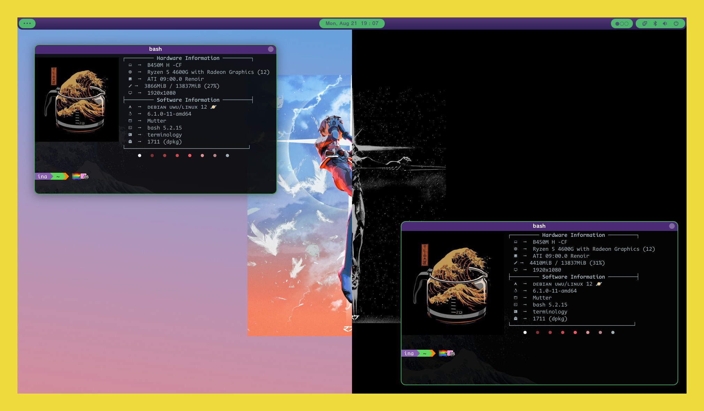
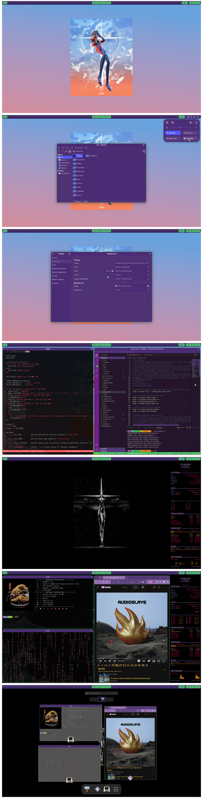

## EVA-01 Rebuild theme


<sup>*Light and Dark themes*</sup>

EVA-01 Rebuild ~~Layan~~ is a flat Material Design theme for GTK 3, GTK 2 and Gnome-Shell which supports GTK 3 and GTK 2 based desktop environments like Gnome, Budgie, etc. *This is a fork based on the Layan Theme.*

## Info

### GTK+ 3.20 or later

### GTK2 engines requirment
- GTK2 engine Murrine 0.98.1.1 or later.
- GTK2 pixbuf engine or the gtk(2)-engines package.

Fedora/RedHat distros:

    dnf install gtk-murrine-engine gtk2-engines

Ubuntu/Mint/Debian distros:

    sudo apt-get install gtk2-engines-murrine gtk2-engines-pixbuf

ArchLinux:

    pacman -S gtk-engine-murrine gtk-engines

Other:
Search for the engines in your distributions repository or install the engines from source.

## Install Or Uninstall

Run the following commands in the terminal:

```sh
./install.sh
```

Usage:  `./install.sh`  **[OPTIONS...]**

```
  -d, --dest DIR          Specify destination directory (Default: $HOME/.themes)
  -n, --name NAME         Specify theme name (Default: Layan)
  -c, --color VARIANT     Specify color variant(s) [standard|light|dark] (Default: All variants)

  -l, --libadwaita        Link installed gtk-4.0 theme to config folder for all libadwaita app use this theme

  -r, --remove,
  -u, --uninstall         Uninstall/Remove installed themes

  -h, --help              Show help
```

For example: install all themes

```sh
./install.sh -t all -s all
```

### Duo Wallpaper for GNOME Light/Dark mode

I have created these custom wallpapers myself, using the original art of [Ikhimaz](https://www.artstation.com/ikhimaz).

This theme supports different wallpapers for light and dark modes.

To install you can manually copy the files on`/src/wallpaper/eva_rebuild_wallpaper` to `/home/$USER/.local/share/gnome-background-properties/` or `/usr/share/gnome-background-properties/`

You can use these commands to automatically do that.

Install wallpaper as local user:

    cd ~
    mkdir -p .local/share/gnome-background-properties/
    cp -a src/wallpaper/eva_rebuild_wallpaper/. /home/$USER/.local/share/gnome-background-properties/

Install as root for all users:

    sudo cp -a src/wallpaper/eva_rebuild_wallpaper/. /usr/share/gnome-background-properties/


### Showcase


